# Traffic Re:View — Final V5

22 สไลด์ / 14 กราฟ เรียงตามลำดับนำเสนอ ผลจากไฟล์ `bangkok_traffic_2560_Present (NotFinal) (5).xlsx` ชีต `traffic_data` เท่านั้น

SHA256 `9f3bbdb744a3216ef2c0476a51aef87603fff0de24d133ae4f0debee1760259c`

ข้อมูลฉบับร่าง: Final หมายถึงรูปแบบนำเสนอ ไม่ใช่การรับรองว่าทุกค่าตรงกับ PDF ต้นทาง

## วิธีใช้

เปิด Presentation.html เพื่อไล่สไลด์ ใช้ลูกศร ← → หรือคลิกปุ่ม; กด P เพื่อพิมพ์ทุกหน้า สไลด์ 1–19 เป็นเรื่องหลัก 20–22 เป็นภาคผนวก ถ้าเวลาน้อยใช้ 1,2,3,5,7,10,11,12,13,15,16,17,18,19 และเปิดที่เหลือตอนถามตอบ เวลาจริงต้องอิงประกาศรายวิชา

## วิธีและผลหลัก

Before 100 → During 91.5 → After 90.2 | n=721 หน่วย

ช่วง 95%: During 87.9–94.9; After 86.6–93.0 จาก cluster bootstrap 1,000 รอบตามทางแยก ไม่รวมความเอนเอียงจากการเลือกตัวอย่าง ไม่ใช่ผลเชิงสาเหตุ

ทุกหน่วยคือ ทางแยก–ถนน–เวลาสำรวจ ไม่เท่ากับจำนวนทางแยก; ใช้ covid_period ตามไฟล์; ข้อมูลล่าสุดถึง 2026-05-29

## กราฟ 01 — ข้อมูลครอบคลุมวันใดบ้าง

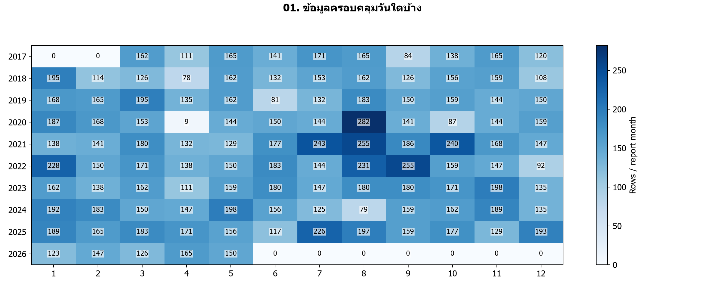

**คำถามและวิธีอ่าน:** สีและตัวเลขคือจำนวนแถวต่อเดือนรายงาน ไม่ใช่ปริมาณรถ

**หลักฐาน:** วันสำรวจ 2017-03-01 ถึง 2026-05-29 | 17,440 แถว → ผ่านเกณฑ์ 17,250 แถว

**แนวพูด:** เรามีข้อมูลหลายปี แต่ไม่ได้มีทุกแยกทุกวัน จึงรวมยอดรายปีมาเทียบตรง ๆ ไม่ได้

**ข้อจำกัด:** ข้อมูลเป็นวันสำรวจบางวัน และปีล่าสุดไม่ครบปี; ช่อง 0 คือไม่มีรายการในไฟล์

**นำไปใช้:** เปรียบเทียบหน่วยเดิมและเวลาเดิมก่อนตีความ

[ตารางคำนวณ](tables/coverage.csv)

## กราฟ 02 — ปริมาณรถในหน่วยที่จับคู่ครบสามช่วง

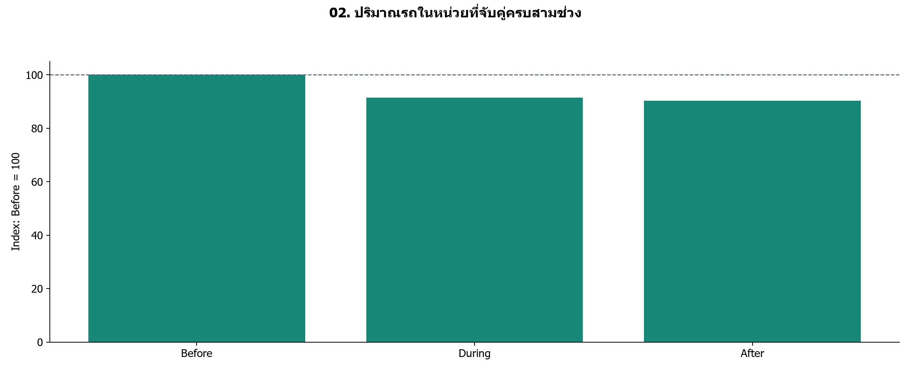

**คำถามและวิธีอ่าน:** ใช้มัธยฐานคัน/ชั่วโมงของแต่ละหน่วยในแต่ละช่วง หารฐาน Before ของหน่วยนั้น แล้วหามัธยฐานข้ามหน่วย

**หลักฐาน:** Before 100 → During 91.5 → After 90.2 | n=721 หน่วย

**แนวพูด:** ตั้ง Before ของแต่ละหน่วยเป็น 100 ผลภาพรวมคือ Before 100 → During 91.5 → After 90.2 | n=721 หน่วย จึงพบระดับต่ำกว่าฐานทั้งสองช่วง แต่ยังแยกสาเหตุไม่ได้ ช่วง 95%: During 87.9–94.9; After 86.6–93.0

**ข้อจำกัด:** เป็นดัชนีของตัวอย่าง ไม่ใช่ยอดรถรวมทั้งเมือง; ไม่พิสูจน์ผลเชิงสาเหตุ

**นำไปใช้:** เริ่มดูการกระจายและสถานที่ เพราะค่ากลางอาจซ่อนความต่าง

[ตารางคำนวณ](tables/overview.csv)

## กราฟ 03 — แต่ละหน่วยอยู่เหนือหรือต่ำกว่าฐาน

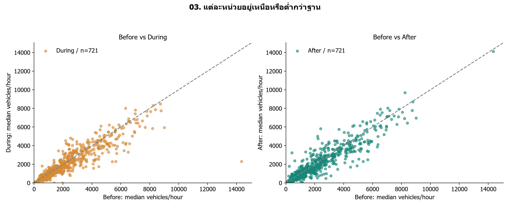

**คำถามและวิธีอ่าน:** หนึ่งจุดคือทางแยก–ถนน–ช่วงเวลา; จุดใต้เส้นทแยงมีปริมาณต่ำกว่า Before

**หลักฐาน:** ต่ำกว่าฐาน: During 64.5% | After 65.3% ของ 721 หน่วย

**แนวพูด:** เส้นทแยงคือระดับเท่าเดิม เรามีทั้งจุดที่สูงขึ้นและต่ำลง ไม่ใช่ทุกแห่งเปลี่ยนไปในทิศทางเดียวกัน

**ข้อจำกัด:** จุดสำรวจไม่ได้เป็นตัวอย่างสุ่มทั้งกรุงเทพฯ; จุดบนแกนศูนย์ยังแสดงไว้

**นำไปใช้:** ไม่ใช้ค่ากลางแทนการตัดสินทุกทางแยก

[ตารางคำนวณ](tables/matched_levels.csv)

## กราฟ 04 — ค่ากลางซ่อนการกระจายมากแค่ไหน

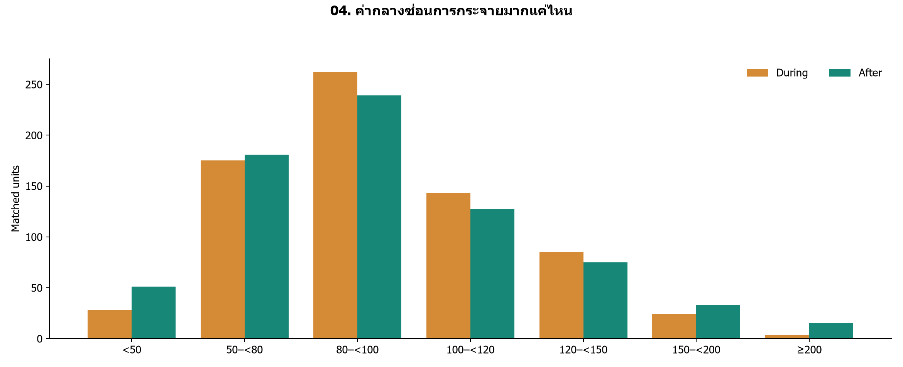

**คำถามและวิธีอ่าน:** แกนนอนเป็นช่วงดัชนี โดย 100 เท่าฐาน; แกนตั้งคือจำนวนหน่วย ใช้ชุดเดิมครบทั้งสองช่วง

**หลักฐาน:** After มี 250/721 หน่วย (34.7%) ที่ไม่น้อยกว่าฐาน

**แนวพูด:** ค่า After ใกล้ 90 ไม่ได้แปลว่าทุกแยกลด 10 เปอร์เซ็นต์ กราฟนี้แสดงทั้งกลุ่มต่ำกว่าฐานและกลุ่มที่กลับมาไม่น้อยกว่าฐาน

**ข้อจำกัด:** ช่วงท้ายรวมดัชนีตั้งแต่ 200 ขึ้นไป; ฐานน้อยทำให้เปอร์เซ็นต์เปลี่ยนสูงได้

**นำไปใช้:** ใช้ข้อมูลคัน/ชั่วโมงประกอบดัชนีเมื่อเลือกจุดศึกษา

[ตารางคำนวณ](tables/index_distribution.csv)

## กราฟ 05 — การเปลี่ยนแปลงมีสี่รูปแบบ

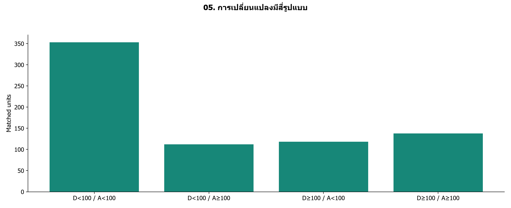

**คำถามและวิธีอ่าน:** D = During, A = After; แบ่งด้วยดัชนี 100 ของ Before โดยใช้หน่วยเดิมทั้งหมด

**หลักฐาน:** ต่ำกว่าฐานทั้งสองช่วง 353 หน่วย; During ต่ำ แต่ After ≥ ฐาน 112 หน่วย

**แนวพูด:** การบอกเพียงว่าฟื้นหรือไม่ฟื้นยังหยาบเกินไป เราแยกได้สี่แบบ บางแห่งต่ำกว่าฐานทั้งสองช่วง บางแห่งกลับมาไม่น้อยกว่าฐานใน After

**ข้อจำกัด:** เป็นการจำแนกระดับ ไม่ใช่เส้นทางรายปีต่อเนื่อง และไม่ใช่การทดสอบนัยสำคัญ

**นำไปใช้:** ใช้รูปแบบเป็นเกณฑ์เลือกกรณีศึกษาหรือสำรวจซ้ำ

[ตารางคำนวณ](tables/period_patterns.csv)

## กราฟ 06 — ช่วงเวลาสำรวจให้ผลเหมือนกันหรือไม่

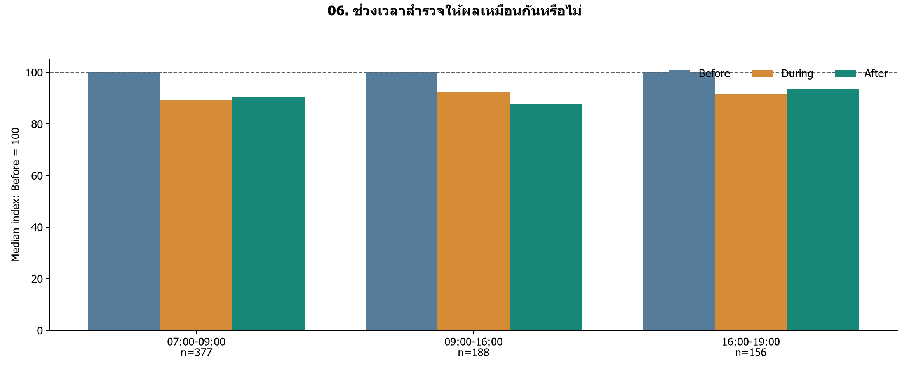

**คำถามและวิธีอ่าน:** แต่ละกลุ่มเปรียบเทียบสามช่วงภายในเวลาเดียวกัน; ทุกค่าหารด้วยชั่วโมงสำรวจแล้ว

**หลักฐาน:** มี 3 ช่วงเวลาที่จับคู่ได้; จำนวนหน่วยต่อเวลา 156–377 หน่วย

**แนวพูด:** เวลาเย็น 16–19 กับ 17–19 เป็นคนละหน่วย เราไม่รวมเพราะอาจทำให้ความหมายเปลี่ยน กลุ่มเล็กต้องอ่านด้วยความระมัดระวัง

**ข้อจำกัด:** กลุ่มเวลาประกอบด้วยสถานที่ต่างกัน จึงไม่ใช้สรุปว่าคนย้ายเวลาเดินทาง

**นำไปใช้:** ถ้าจะตอบการย้ายเวลา ต้องจับคู่จุดและวันที่เดียวกันข้ามเวลาด้วย

[ตารางคำนวณ](tables/time_window_indices.csv)

## กราฟ 07 — สถานที่ที่มีความต่างเด่น

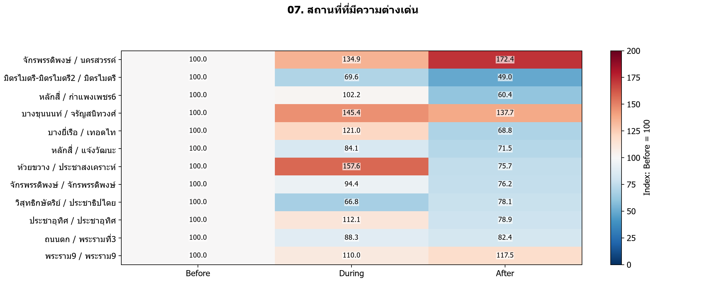

**คำถามและวิธีอ่าน:** แสดงคู่เช้า 07–09 น. ที่มีอย่างน้อย 2 รายการทุกช่วง เลือก 12 คู่ที่ |After−100| มากที่สุด; สเกลสี 0–200

**หลักฐาน:** แสดง 12 คู่; สีแดงมากกว่า Before สีฟ้าต่ำกว่า Before และมีตัวเลขกำกับ

**แนวพูด:** หลังเห็นภาพรวม เราซูมไปยังจุดที่ต่างเด่น โดยเปิดเผยเกณฑ์เลือกตั้งแต่ต้น แล้วตรวจวันที่และประเภทรถต่อ

**ข้อจำกัด:** คัดผลต่างสูงเพื่อศึกษา ไม่เป็นตัวแทนทั้งเมือง; สีตัดที่ 200 แต่ตัวเลขไม่ตัด

**นำไปใช้:** ทวนรายงานต้นทางก่อนตั้งสมมติฐานเรื่องบริบทพื้นที่

[ตารางคำนวณ](tables/location_lookup.csv)

## กราฟ 08 — วันที่สำรวจของกรณีศึกษา

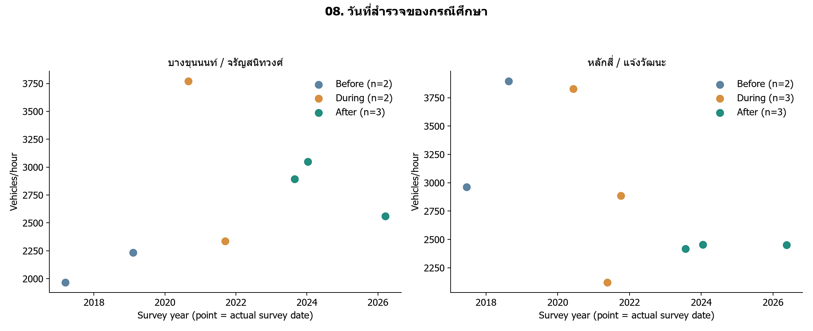

**คำถามและวิธีอ่าน:** แต่ละจุดคือวันสำรวจจริง ไม่ลากเส้นเชื่อม; วันเต็มและแถว Excel อยู่ในตาราง

**หลักฐาน:** บางขุนนนท์: n=2/2/3; หลักสี่: n=2/3/3

**แนวพูด:** จำนวนวันและเดือนของกรณีศึกษาอยู่ในตาราง แม้ค่าจะต่างชัด ก็ยังอธิบายไม่ได้ว่าเกิดจากโควิด เทศกาล งานก่อสร้าง หรือความผันผวนของวันสำรวจ

**ข้อจำกัด:** บางขุนนนท์: เดือนร่วม []; หลักสี่: เดือนร่วม []; [] = ไม่มีเดือนร่วมครบสามช่วง ยังไม่มีหลักฐานเทศกาลหรือปลายทาง

**นำไปใช้:** ใช้วันนี้ไปตรวจ PDF และประวัติเหตุการณ์ แยกสิ่งยืนยันแล้วออกจากสมมติฐาน

[ตารางคำนวณ](tables/case_dates.csv)

## กราฟ 09 — ประเภทรถที่ประกอบเป็นความต่างของพื้นที่

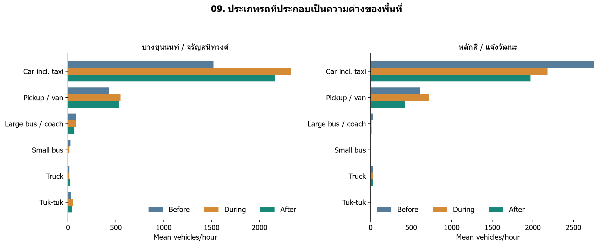

**คำถามและวิธีอ่าน:** ทุกหมวดมี Before / During / After; ใช้ค่าเฉลี่ยคัน/ชั่วโมงเพื่อแสดงระดับของหมวดรถ

**หลักฐาน:** บางขุนนนท์: ดัชนีรถรวม After เทียบ Before +37.7%; หลักสี่: ดัชนีรถรวม After เทียบ Before -28.5%

**แนวพูด:** ดูว่าหมวดใดมีระดับมากและหมวดใดเปลี่ยน โดยยังไม่ตีความว่าเป็นการเปลี่ยนพาหนะของคนกลุ่มเดิม

**ข้อจำกัด:** เปอร์เซ็นต์รถรวมในข้อความคำนวณจากมัธยฐาน แต่แท่งหมวดรถเป็นค่าเฉลี่ย; ห้ามบวกมัธยฐานรายหมวดแทนรถรวม

**นำไปใช้:** ตรวจหมวดที่เปลี่ยนมากกับตารางนับรถต้นทาง

[ตารางคำนวณ](tables/case_vehicle_three_periods.csv)

## กราฟ 10 — องค์ประกอบรถครบสามช่วง

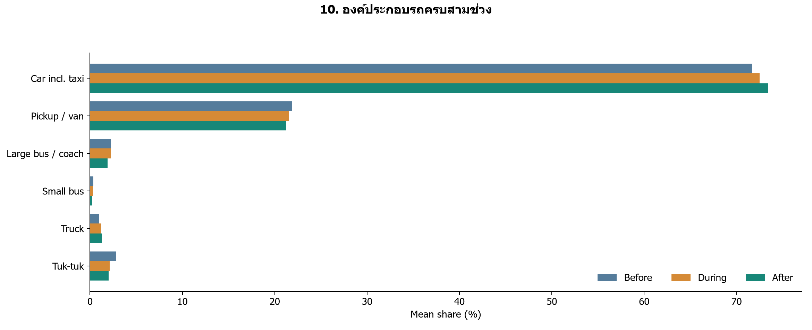

**คำถามและวิธีอ่าน:** คำนวณสัดส่วนแต่ละรายการ → เฉลี่ยในหน่วย–ช่วง → เฉลี่ยข้ามหน่วยร่วมที่มีรถรวมบวกครบทุกช่วง

**หลักฐาน:** รถยนต์รวมแท็กซี่: 71.72% → 72.51% → 73.39% | n=719

**แนวพูด:** รถยนต์เป็นหมวดใหญ่ที่สุดในหกหมวดที่เราเก็บได้ แต่ไม่ใช่ส่วนแบ่งทุกยานพาหนะของกรุงเทพฯ และไม่ใช่รถส่วนตัวทั้งหมด

**ข้อจำกัด:** n=719 หน่วย; สัดส่วนไม่ใช่จำนวน และชุดนี้ไม่มีจักรยานยนต์

**นำไปใช้:** ใช้ประกอบการวางแผนสำรวจหมวดรถเพิ่มเติม

[ตารางคำนวณ](tables/mix_change.csv)

## กราฟ 11 — สัดส่วนหมวดเล็กเปลี่ยนอย่างไร

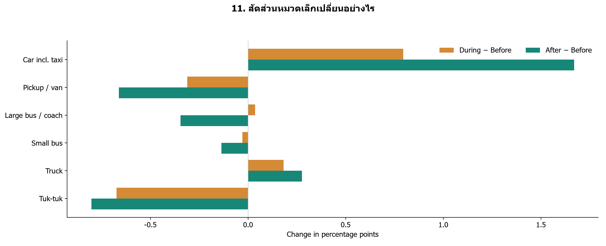

**คำถามและวิธีอ่าน:** ค่าบวกคือส่วนแบ่งเพิ่ม ค่าลบคือส่วนแบ่งลด หน่วยเป็นจุดเปอร์เซ็นต์ ไม่ใช่เปอร์เซ็นต์การเติบโต

**หลักฐาน:** รถยนต์: During +0.80 จุด; After +1.67 จุด เทียบ Before

**แนวพูด:** กราฟก่อนเห็นโครงสร้างใหญ่ ส่วนกราฟนี้ขยายการเปลี่ยนของแต่ละหมวดโดยใช้แกนศูนย์ร่วมกัน

**ข้อจำกัด:** หมวดหนึ่งเพิ่ม ส่วนอื่นต้องลดรวมกันตามนิยามสัดส่วน; ไม่สรุปการย้ายจากรถเมล์ไปใช้รถส่วนตัว

**นำไปใช้:** ถ้าจะศึกษาการเปลี่ยนวิธีเดินทาง ต้องมีข้อมูลผู้เดินทางหรือผู้โดยสารเพิ่ม

[ตารางคำนวณ](tables/mix_delta.csv)

## กราฟ 12 — Lockdown ภายในช่วง During

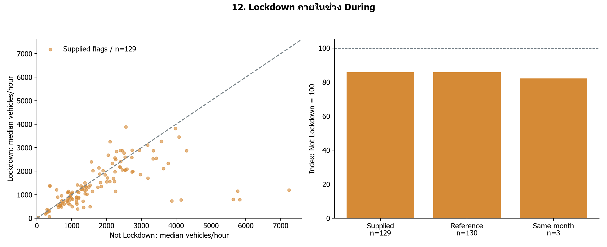

**คำถามและวิธีอ่าน:** จับคู่ทางแยก–ถนน–เวลา ภายใน During เท่านั้น; กราฟขวาเทียบนิยามและเงื่อนไขเดือน

**หลักฐาน:** ตาม flag ในไฟล์ n=129: ดัชนี 85.7 | เทียบกรอบวันที่ 85.9

**แนวพูด:** ผลตาม flag พบระดับต่ำกว่า Not Lockdown แต่วันสำรวจและนิยามยังมีข้อจำกัด เราคง flag ของผู้ใช้และแสดงผลอีกนิยามประกอบ

**ข้อจำกัด:** flag ต่างจากกรอบวันที่อ้างอิง 168 แถว; คุมเดือนเหลือ 3 หน่วย จึงไม่สรุปเชิงสาเหตุ

**นำไปใช้:** ยืนยันเกณฑ์วันสิ้นสุดและทวนแถว flag ก่อนอ้างเป็นผลของมาตรการ

[ตารางคำนวณ](tables/lockdown_summary.csv)

## กราฟ 13 — ข้อสรุปเปลี่ยนเมื่อจับคู่ละเอียดขึ้นหรือไม่

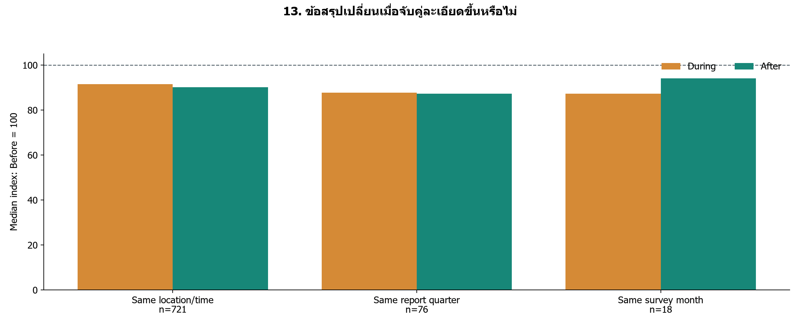

**คำถามและวิธีอ่าน:** เพิ่มเงื่อนไขไตรมาสรายงานหรือเดือนสำรวจ โดยสร้างกลุ่มจับคู่ใหม่ในแต่ละวิธี

**หลักฐาน:** n=721: During 91.5, After 90.2; n=76: During 87.7, After 87.3; n=18: During 87.3, After 94.1

**แนวพูด:** ทุกวิธีในรอบนี้ต่ำกว่าฐาน Before แต่ After เทียบ During ไม่ได้เรียงเหมือนกันทุกวิธี จึงไม่ควรสรุปเส้นทางการฟื้นจากค่ากลางวิธีเดียว

**ข้อจำกัด:** ขนาดและสมาชิกเปลี่ยน จึงแยกผลของการคุมปฏิทินออกจากการเปลี่ยนตัวอย่างไม่ได้

**นำไปใช้:** รายงานผลหลักพร้อมความไว และวางแผนเก็บจุดเดิมเดือนเดิม

[ตารางคำนวณ](tables/sensitivity.csv)

## กราฟ 14 — วันสำรวจของกลุ่มจับคู่เหมือนกันหรือไม่

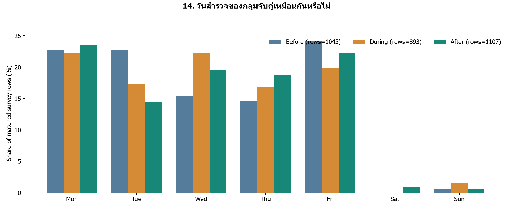

**คำถามและวิธีอ่าน:** สัดส่วนแถวสำรวจตามวันในสัปดาห์ ไม่ใช่สัดส่วนจำนวนรถ; ชุดหลักเดียวกับกราฟภาพรวม

**หลักฐาน:** ใช้ 3,045 แถวที่อยู่ใน 721 หน่วยจับคู่

**แนวพูด:** แม้จะจับคู่สถานที่และเวลาแล้ว วันที่เก็บยังต่างกันได้ กราฟนี้ไว้ตอบคำถามเรื่องปฏิทิน ไม่ใช้สรุปว่าวันใดรถมาก

**ข้อจำกัด:** หลายแถวอาจเป็นวันเดียวกันหรือแยกเดียวกัน; ไม่ได้ตรวจวันหยุดและเทศกาล

**นำไปใช้:** หากเพิ่มข้อมูลวันหยุด ให้จับคู่ประเภทวันเพิ่มและตรวจจำนวนหน่วยที่เหลือ

[ตารางคำนวณ](tables/weekday_counts.csv)

## แหล่งอ้างอิง

- [ผลสำรวจทางแยก สจส. กทม.](https://traffic.bangkok.go.th/re_intersection/intersection/intersection.html)
- [คู่มือ สจส. หมวดรถและงานสำรวจ หน้า 133–137](https://traffic.bangkok.go.th/TechnicalManuals/TTD.pdf#page=139)
- [ปิดสถานที่ 22 มี.ค.–12 เม.ย. 2020](https://www.thaipost.net/main/detail/60470)
- [เริ่มมาตรการ 12 ก.ค. 2021; ไม่ยืนยันวันสิ้นสุด](https://www.bbc.com/thai/thailand-57773493)
- [FHWA: บริบทความต่างตามวันและฤดูกาล](https://www.fhwa.dot.gov/policyinformation/tmguide/tmg_2022/traffic-data-methodologies.cfm)

## สิ่งที่ไม่ใช้สรุป

ไม่สร้างแผนที่ความหนาแน่นทั้งกรุงเทพฯ เมื่อยังไม่มีพิกัดและความครอบคลุมที่ตรวจแล้ว ไม่ใช้กราฟรายปีคนละจุดสรุปการฟื้น ไม่เดาว่ารถไปที่ใดหรือเป็นเทศกาลใด

## เปลี่ยน Raw Data

รัน `python src/final_project.py --input "new.xlsx"` จากโฟลเดอร์ V5 โปรแกรมจะสร้าง run ใหม่ ตรวจ audit และคำนวณใหม่ ไม่ทับผลก่อนหน้า ข้อมูลต้องมีชีต traffic_data และ schema เดิม; ถ้าไม่มี flag / กรณีศึกษาครบเกณฑ์ รุ่น Final นี้จะหยุดแทนการเติมผลเก่า ควรตรวจ audit ใหม่ก่อนใช้ผล

AI ช่วยจัดโค้ด กราฟ และคำอธิบาย ผู้จัดทำต้องตรวจต้นทาง แก้ไขข้อสรุป และเติมสมาชิก/การแบ่งหน้าที่ตามจริงก่อนส่งตามข้อกำหนดอาจารย์
