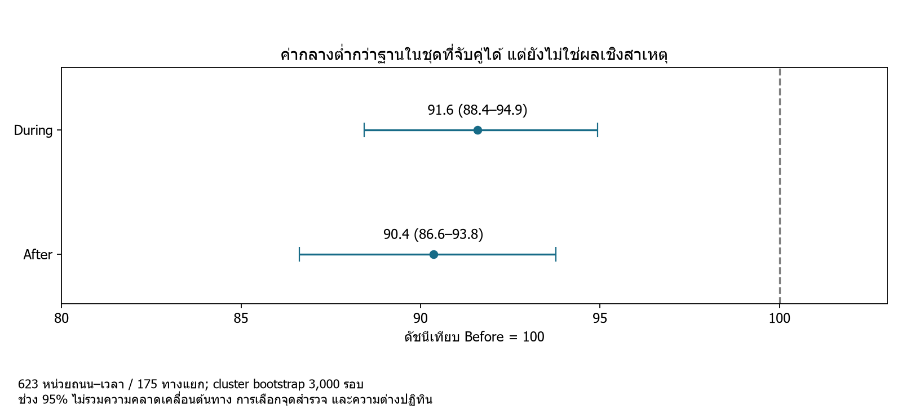
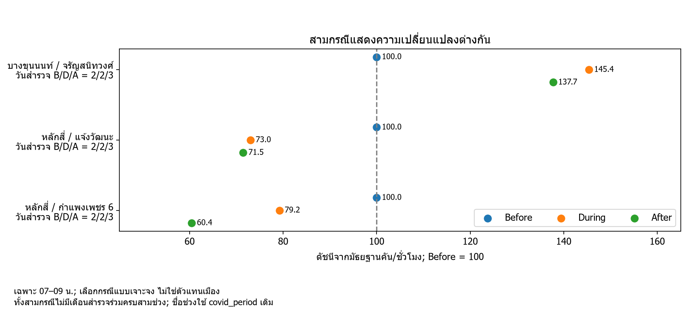
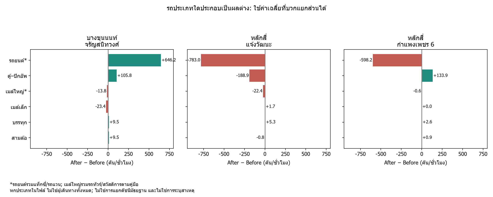
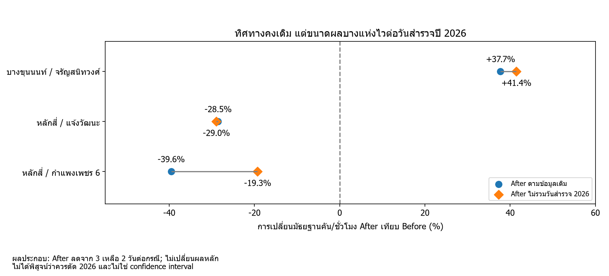

# Bangkok Traffic: ภาพรวมต่ำกว่าฐาน แต่แต่ละสถานที่เปลี่ยนไม่เหมือนกัน

ฉบับนำเสนอ V2 | ข้อมูลฉบับร่าง มีนาคม 2017–พฤษภาคม 2026 | Pandas และ Matplotlib

## ผลสำคัญ

- ชุดสถานที่และเวลาเดียวกันมีมัธยฐานดัชนี During 91.6 และ After 90.4 เมื่อ Before = 100; ยังไม่พิสูจน์ว่าโควิดเป็นสาเหตุ
- บางขุนนนท์–จรัญสนิทวงศ์เพิ่ม 37.7% ขณะที่หลักสี่–แจ้งวัฒนะลด 28.5% ในสามกรณีที่คัดเลือก
- หลักสี่–กำแพงเพชร 6 มีรถยนต์ตามหมวดหน่วยงานลด แต่ตู้–ปิกอัพเพิ่ม; เมื่อไม่รวมวันสำรวจ 2026 ขนาดการลดของรถรวมเปลี่ยนจาก 39.6% เป็น 19.3%

## ที่มาและคำถาม

ใช้ผลสำรวจทางแยกที่เผยแพร่โดย [สำนักการจราจรและขนส่ง กรุงเทพมหานคร](https://traffic.bangkok.go.th/re_intersection/intersection/intersection.html) ผ่านไฟล์ที่รวบรวมชื่อ `bangkok_traffic_2560_Present (NotFinal) (1).xlsx` ชีต traffic_data จำนวน 17,005 แถว ไม่ใช่ข้อมูลต่อเนื่องของทุกแยกทุกวัน

คำถามคือ (1) หน่วยสถานที่–เวลาเดียวกันต่างกันระหว่างช่วงโควิดอย่างไร (2) แต่ละสถานที่เปลี่ยนเหมือนกันหรือไม่ และ (3) รถประเภทใดประกอบเป็นผลต่าง

ตาม [คู่มือ สจส. พ.ศ. 2564 หน้าเลขพิมพ์ 133–137](https://traffic.bangkok.go.th/TechnicalManuals/TTD.pdf#page=139) การสำรวจรองรับความต้องการข้อมูลและการวางแผน เช่น สัญญาณไฟ ทางข้าม และจุดกลับรถ แต่ยังไม่มีใบงานยืนยันเหตุผลการเลือกทุกจุดในไฟล์เรา

## วิธีวิเคราะห์

ใช้ covid_period ในไฟล์โดยตรง; Before 2017–2019, During 2020–2021, After 2022–พฤษภาคม 2026 ตามขอบเขตงาน ตัด 2016 แยกวันที่รายงานกับวันที่สำรวจจริง ค่าว่าง/ขีดของประเภทรถแทนศูนย์ตามข้อตกลง แต่ไม่เติมรายการสำรวจที่ไม่มี

คำนวณคันต่อชั่วโมงจากจำนวนหารชั่วโมงสำรวจ จับคู่ทางแยก+ถนน+เวลาเดียวกันครบสามช่วง ชุดหลักมี 2,612 แถว 623 หน่วย จาก 175 ทางแยก ใช้มัธยฐานภายในหน่วยและช่วง ก่อนสร้างดัชนีเทียบฐานของหน่วยเดียวกัน ไม่ใช้ยอดรวมคนละชุดสถานที่เป็นแนวโน้มเมือง

## 1. ภาพรวมพร้อมความไม่แน่นอน

จุดคือมัธยฐานดัชนี เส้นคือ percentile 95% จากการสุ่มซ้ำระดับทางแยก 3,000 รอบ: During 88.4–94.9, After 86.6–93.8 ช่วงทั้งคู่ต่ำกว่า 100 ภายใต้การสุ่มซ้ำนี้ แต่ไม่รวมอคติการเลือกสถานที่ ความผิดต้นทาง หรือความต่างฤดูกาล และไม่ใช่การทดสอบ After เทียบ During โดยตรง

## 2. ความต่างรายสถานที่

คัดสามกรณีจากชุดที่มีการตรวจวันสำรวจและ leave-one-out แล้ว ให้มีทั้งเพิ่ม ลด และองค์ประกอบสวนทาง ไม่ใช่การสุ่มตัวแทน แต่ละกรณีมีวัน Before/During/After = 2/2/3 วัน และไม่มีเดือนสำรวจร่วมครบทั้งสามช่วง จึงไม่ถือว่าควบคุมฤดูกาลแล้ว

บางขุนนนท์เพิ่ม 37.7%; หลักสี่–แจ้งวัฒนะลด 28.5%; หลักสี่–กำแพงเพชร 6 ลด 39.6% ตัวเลขเป็นผลของหน่วยที่เลือก ไม่ใช่การจัดอันดับทั้งเมือง หลักฐานวันที่และแถว Excel อยู่ใน [survey_dates.csv](tables/survey_dates.csv)

## 3. องค์ประกอบของผลต่าง

ค่าเฉลี่ยรถยนต์ของบางขุนนนท์เพิ่มประมาณ 646.2 คัน/ชั่วโมง ส่วนหลักสี่–กำแพงเพชร 6 ลดประมาณ 598.2 แต่ตู้–ปิกอัพเพิ่ม 133.9 คัน/ชั่วโมง ผลรวมแบบมีเครื่องหมายของหกประเภทเท่ากับผลต่างค่าเฉลี่ยรถรวม เป็นการแยกส่วนเชิงตัวเลข ไม่ใช่การแยกสาเหตุ และไม่ใช่ดัชนีมัธยฐานจากภาพก่อนหน้า

**นิยามที่แก้จากคำอธิบายเดิม:** รถยนต์รวมแท็กซี่/รถแวนตามคู่มือ จึงไม่เรียกว่า “รถส่วนตัว” ทั้งกลุ่ม; เมล์ใหญ่รวมรถทัวร์และสวัสดิการ จึงไม่เท่ากับรถประจำทางอย่างเดียว ผลรวมครอบคลุมรถหกหมวดที่บันทึก ไม่ใช่ยานพาหนะทุกประเภทหรือจำนวนผู้เดินทาง นิยามจากคู่มือ 2564 ยังต้องตรวจว่าคงเดิมทุกปีหรือไม่

## 4. ตรวจข้อสรุปก่อนนำไปใช้

เมื่อตัดวันสำรวจ 2026 ออกจาก After เพื่อดูความไว ทั้งสามกรณียังคงทิศทางเดิม แต่กำแพงเพชร 6 ลดจาก 39.6% เหลือ 19.3% แสดงว่าขนาดผลไวต่อวันสำรวจ ผลประกอบนี้เหลือ After เพียงสองวัน ไม่เสนอให้ลบข้อมูลหรือแทนผลหลัก

การตัดวันออกทีละรายการให้ช่วงการเปลี่ยนแปลง: บางขุนนนท์ +29.5 ถึง +47.1%; แจ้งวัฒนะ −37.1 ถึง −17.3%; กำแพงเพชร 6 −50.2 ถึง −19.3% ช่วงเหล่านี้ไม่ใช่ช่วงความเชื่อมั่น

เมื่อเพิ่มเงื่อนไขจับคู่เดือน ชุดหลัก 623 หน่วยเหลือ 15 หน่วย และ After เปลี่ยนจาก 90.4 เป็น 96.1 ขณะที่ During เปลี่ยนจาก 91.6 เป็น 85.5 ดังนั้นเรื่อง “After ฟื้นจาก During หรือไม่” ไวต่อการจับคู่และชุดสมาชิก ส่วนข้อสังเกตว่าทั้งคู่ต่ำกว่าฐานยังพบในแบบเหล่านี้ [ตารางผล](tables/matching_sensitivity.csv)

## ข้อเสนอแนะที่ข้อมูลรองรับ

1. เลือกพื้นที่สำรวจซ้ำโดยดูทั้งผลต่าง จำนวนวัน และความไวของผล
2. เก็บจุดเดิม เวลาเดิม เดือนและประเภทวันใกล้เคียงกัน เพื่อให้เปรียบเทียบได้ดีขึ้น
3. ทวนช่องศูนย์กับต้นทาง โดยเฉพาะรถพบน้อย ไม่ถือว่าสมมติฐานศูนย์ได้รับการยืนยันแล้ว
4. หากต้องการประเมินรถติดหรือปรับสัญญาณไฟ ต้องเพิ่มความเร็ว เวลาเดินทาง แถวคอย และทิศทางรถ

## ข้อจำกัดและสถานะข้อมูล

ยังมีค่าที่เคยพบไม่ตรง PDF ต้นทางใน L09 ซึ่งไม่นำมาเป็นกรณีหลักของฉบับนี้ แต่ยังอยู่ในผลภาพรวมเดิม การเลือกสามกรณีไม่ได้แปลว่าทวนต้นทางครบทุกแถว L13 มีหนึ่งแถวที่ใช้สมมติฐานศูนย์; L03/L14 ไม่มีในชุดกรณีนี้ ไม่มีข้อมูลปลายทาง ฝน ก่อสร้าง หรือกิจกรรมครบทุกวัน จึงไม่แต่งเหตุผลของความเปลี่ยนแปลง

## แหล่งอ้างอิง

- [รายงานปริมาณจราจร สจส.](https://traffic.bangkok.go.th/re_intersection/intersection/intersection.html): แหล่งต้นทาง
- [คู่มือ สจส.](https://traffic.bangkok.go.th/TechnicalManuals/TTD.pdf#page=139): วัตถุประสงค์และนิยาม ไม่ใช่ใบรับรองวิธีสำรวจทุกแถว
- [FHWA Traffic Monitoring Guide](https://www.fhwa.dot.gov/policyinformation/tmguide/tmg_2022/traffic-data-methodologies.cfm): หลักการคำนึงถึงเวลา วันและฤดูกาล ไม่อ้างว่า กทม. ใช้ทุกข้อ

## ไฟล์และการนำขึ้น GitHub

อัปโหลดเนื้อหาภายใน ZIP ทั้งหมดโดยให้ README.md อยู่ระดับเดียวกับ figures/ และ tables/ ลิงก์รูปจะเปิดได้ในหน้าแรก หากใช้ repository เดิมให้เพิ่มเป็นโฟลเดอร์ presentation_v2 แล้วลิงก์จาก README หลัก

ชุดนี้เป็นฉบับเล่าเรื่องพร้อมกราฟใหม่ ไม่ใช่โค้ดโปรเจคทั้งหมด ดู [บันทึกสิ่งที่เปลี่ยน](CHANGES.md) และ [แนวพูด](Speaker_Notes.md) โค้ด build_v2.py ใช้สร้างฉบับนี้ในโครงสร้างโปรเจคเดิม โดยอ่าน outputs ที่มีอยู่ ไม่รันแบบ standalone จาก ZIP อย่างเดียว

ก่อนส่งอาจารย์ยังต้องแนบโค้ด/Notebook เดิม เตรียม PDF ตามข้อกำหนด และเติมการแบ่งงานสมาชิกกับบทบาท AI ตามจริง ไม่กำหนดจำนวนกราฟเป็นเกณฑ์ของอาจารย์
