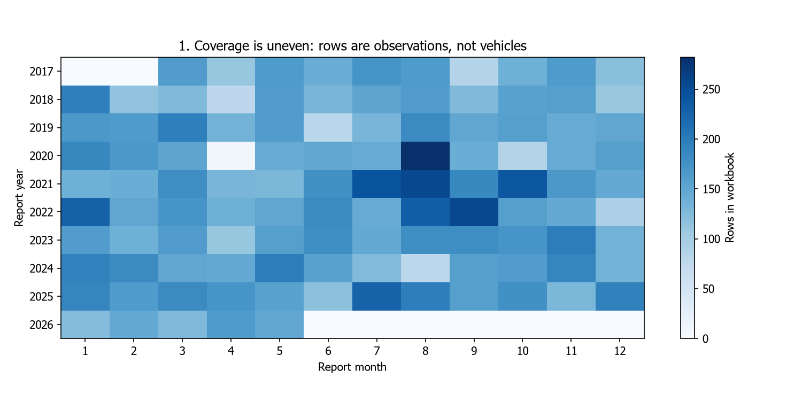
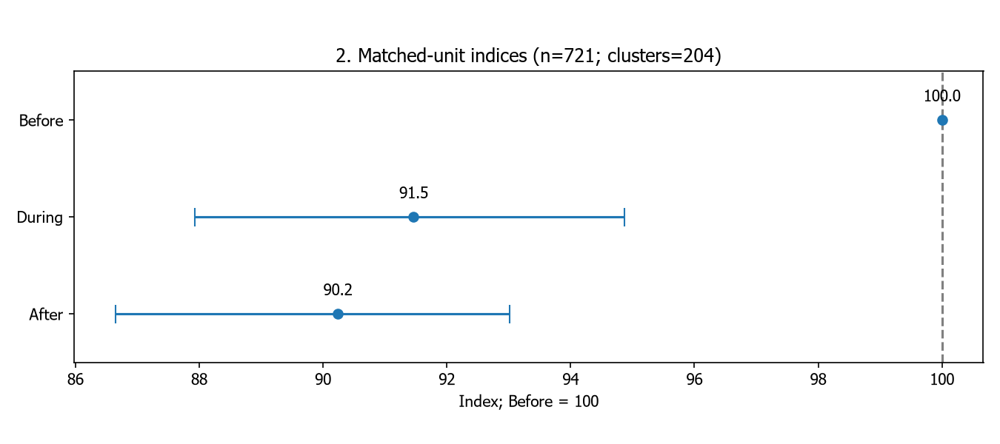
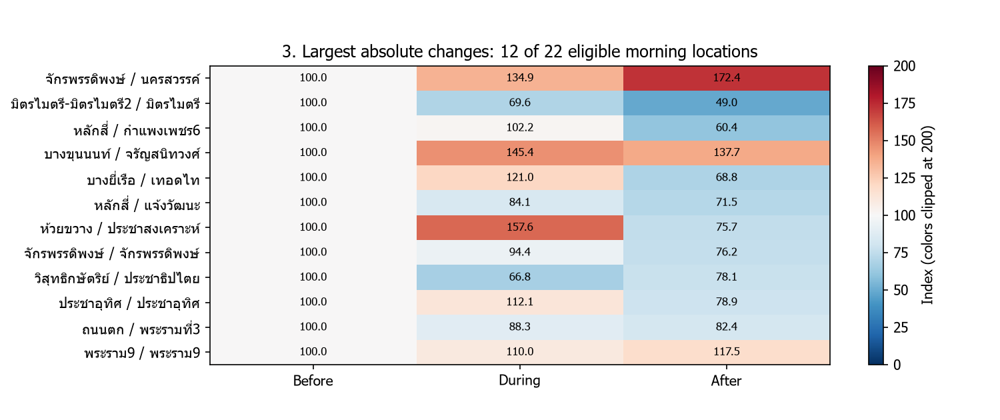
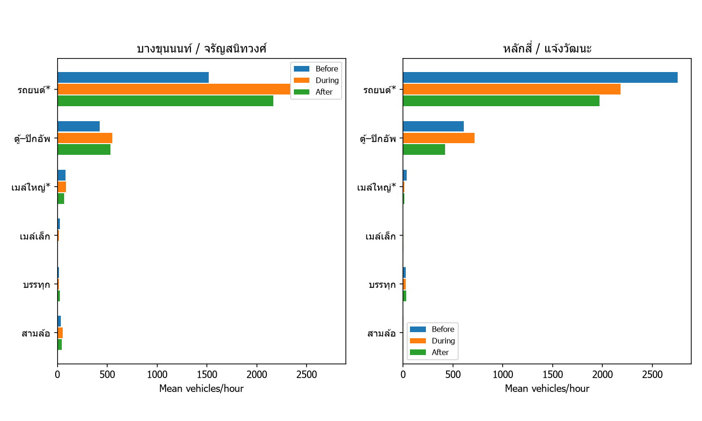
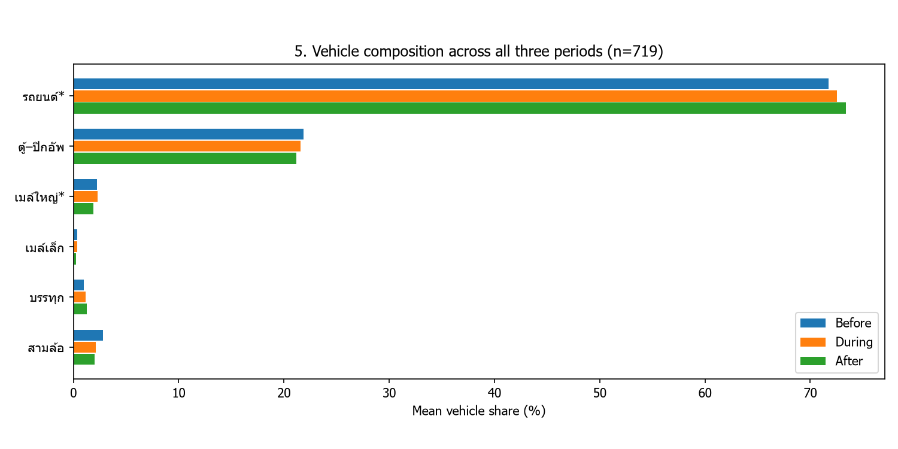
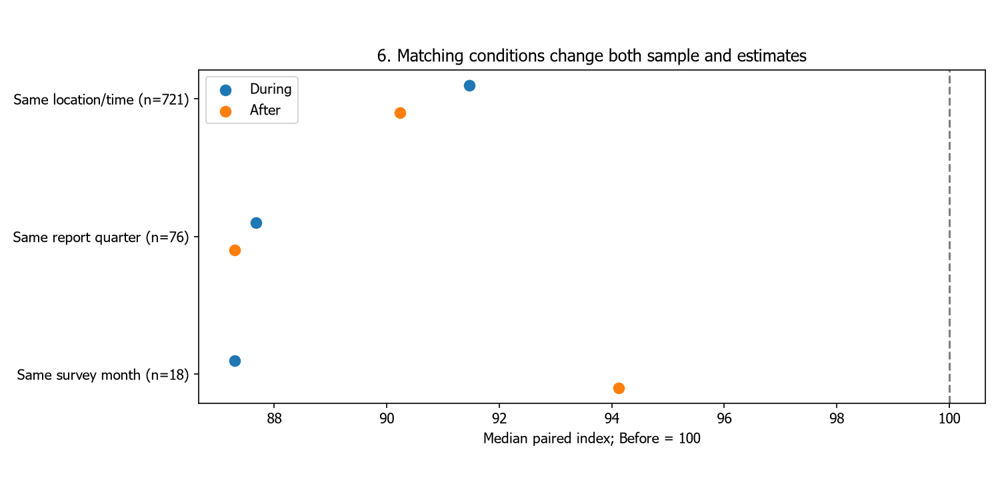
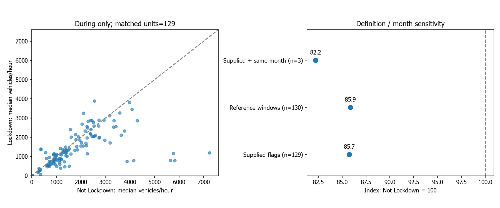

# Bangkok Traffic V4 — ปริมาณรถและความต่างรายสถานที่

ข้อมูลไฟล์รุ่นใหม่: audit นี้ไม่ใช่การรับรองความตรงกับ PDF ต้องตรวจต้นทางแยก

ข้อมูลจาก `bangkok_traffic_2560_Present (NotFinal) (5).xlsx` ชีต traffic_data | SHA256 `9f3bbdb744a3216ef2c0476a51aef87603fff0de24d133ae4f0debee1760259c`

วันสำรวจที่ผ่านเกณฑ์ 2017-03-01 ถึง 2026-05-29 | ชื่อช่วงใช้ covid_period จากไฟล์ ไม่จัดใหม่จากปี

## ผลสำคัญ

During=91.5; After=90.2; Before=100; กลุ่มหลัก 721 หน่วย กรณีศึกษาที่ผ่านเกณฑ์ 2 คู่ ทุกผลคำนวณใหม่จากไฟล์นี้ ไม่อ่านผล V1/V2

## ที่มาและวิธี

[สำนักการจราจรและขนส่ง](https://traffic.bangkok.go.th/re_intersection/intersection/intersection.html) เผยแพร่ผลสำรวจจุดทางแยก ไม่ใช่ข้อมูลต่อเนื่องทุกวัน เป้าหมายคือเปรียบเทียบหน่วยเดียวกัน ดูความต่างพื้นที่ และองค์ประกอบรถ

คัน/ชั่วโมง = ผลรวมรถหกหมวด / ชั่วโมงสำรวจ; ใช้มัธยฐานภายในหน่วย–ช่วง ก่อนหารฐาน Before ของหน่วยเดียวกัน; Before=0 ไม่สร้างดัชนี ไม่ลบปีล่าสุดจากผลหลัก ไม่อ้างเป็นยอดเต็มปี ค่าว่าง/ขีดแทนศูนย์ตามข้อตกลง ไม่เติมวันหรือจุดสำรวจที่ไม่มี

V4 เพิ่มเงื่อนไขวันที่สำรวจต้องแปลได้และปีสำรวจ>=2017 จึงอาจต่างจากรุ่นเก่า ดู [audit](AUDIT.md) และ [รายการตัดออก](tables/survey_date_exclusions.csv)

## 1. ขอบเขตข้อมูลก่อนตีความ

**อ่านอย่างไร:** สีคือจำนวนแถวในเดือนรายงาน ไม่ใช่จำนวนรถ

**ผลรอบนี้:** ไฟล์มี 17,440 แถว; ผ่านเกณฑ์ V4 17,250 แถว; จับคู่หลัก 3,045 แถว / 721 หน่วย

**ข้อจำกัด:** ช่องศูนย์หมายถึงไม่มีรายการในไฟล์ ไม่ใช่ไม่มีรถ; ขอบเขตที่ตรวจไม่รับรองว่าเป็นทุกเดือนที่หน่วยงานมี

**แนวพูด:** เริ่มจากตรวจว่าเรามีข้อมูลจุดไหนและเมื่อไร แล้วเปรียบเทียบเฉพาะหน่วยเดียวกัน

## 2. ภาพรวมของชุดที่จับคู่ได้

**อ่านอย่างไร:** จุดคือมัธยฐานดัชนี เส้นคือ percentile 95% จาก cluster bootstrap 1,000 รอบ seed 5001; Before=100 ตามนิยาม ไม่ใช่ไม่มีความผิดการวัด

**ผลรอบนี้:** During=91.5; After=90.2; Before=100

**ข้อจำกัด:** ไม่ใช่ผลเชิงสาเหตุ; bootstrap ไม่รวม selection bias และความผิดต้นทาง ไม่ได้ทดสอบ After–During โดยตรง

**แนวพูด:** During=91.5; After=90.2; Before=100 เป็นภาพรวมของตัวอย่าง ไม่ใช่รถทั้งหมดในกรุงเทพฯ

## 3. แต่ละสถานที่เปลี่ยนเหมือนกันหรือไม่

**อ่านอย่างไร:** แต่ละแถวคือทางแยก–ถนน Before ของแต่ละแห่ง=100

**ผลรอบนี้:** มี 22 คู่เช้าที่สำรวจอย่างน้อยสองรายการทุกช่วง แสดง 12 คู่ที่ผล After ต่างจาก 100 มากที่สุด

**ข้อจำกัด:** ตั้งใจเลือกผลต่างสูง จึงไม่ใช้ภาพนี้เป็นตัวแทนการกระจายทั้งเมือง; ปฏิทินไม่จำเป็นต้องตรงกัน

**แนวพูด:** ดัชนีเปรียบเทียบกับฐานของแต่ละสถานที่ ไม่ใช่อันดับจำนวนรถ

## 4. ประเภทรถในกรณีศึกษาที่ผ่านเกณฑ์ ครบสามช่วง

**อ่านอย่างไร:** แต่ละประเภทรถมีสามแท่ง Before / During / After ใช้ค่าเฉลี่ยคันต่อชั่วโมง

**ผลรอบนี้:** บางขุนนนท์/จรัญสนิทวงศ์ รถรวมเปลี่ยนมัธยฐาน After เทียบ Before +37.7%; หลักสี่/แจ้งวัฒนะ รถรวมเปลี่ยนมัธยฐาน After เทียบ Before -28.5%

**ข้อจำกัด:** กราฟใช้ค่าเฉลี่ย ส่วนเปอร์เซ็นต์ในข้อความใช้มัธยฐาน; รถยนต์รวมแท็กซี่ ไม่ใช่หลักฐานสาเหตุ

**แนวพูด:** เปรียบเทียบทั้งสามแท่งในหมวดเดียวกันก่อนดูว่าประเภทใดเปลี่ยนสวนทางกัน

## 5. องค์ประกอบรถ Before–During–After

**อ่านอย่างไร:** สัดส่วนรายรายการ → เฉลี่ยในหน่วย–ช่วง → เฉลี่ยข้ามหน่วยร่วม; แสดงสามช่วงในทุกหมวด

**ผลรอบนี้:** หมวดรถยนต์ Before=71.72%, During=72.51%, After=73.39% จาก 719 หน่วย

**ข้อจำกัด:** สัดส่วนเพิ่มไม่เท่ากับจำนวนเพิ่ม; หกหมวดไม่ใช่ทุกยานพาหนะและไม่ใช่ผู้โดยสาร

**แนวพูด:** ดูว่าช่วง During และ After ต่างจาก Before อย่างไร ไม่ตีความเป็นการเปลี่ยนไปใช้รถส่วนตัว

## 6. ข้อสรุปไวต่อเงื่อนไขหรือไม่

**อ่านอย่างไร:** แต่ละแถวเป็นวิธีจับคู่ต่างกัน จำนวนหน่วยแสดงข้างชื่อ

**ผลรอบนี้:** Same location/time: n=721, During=91.5, After=90.2; Same report quarter: n=76, During=87.7, After=87.3; Same survey month: n=18, During=87.3, After=94.1

**ข้อจำกัด:** สมาชิกเปลี่ยนเมื่อเพิ่มเงื่อนไข จึงไม่ใช่การทดลองเปลี่ยนเงื่อนไขบนกลุ่มเดิมทั้งหมด

**แนวพูด:** ไม่เลือกเฉพาะวิธีที่ให้เรื่องราวสวย ต้องรายงานว่าทิศทางเทียบฐานและ After เทียบ During สอดคล้องหรือเปลี่ยนไปอย่างไร

## 7. Lockdown เทียบ Not Lockdown ภายใน During

**อ่านอย่างไร:** ซ้าย: หน่วยเดิมเวลาเดิม จุดใต้เส้นมีค่า Lockdown ต่ำกว่า; ขวา: ดัชนีมัธยฐานเทียบ Not Lockdown=100

**ผลรอบนี้:** ตาม flag ผู้ใช้ จับคู่ 129 หน่วย 278 แถว ดัชนี=85.7; Flag ในไฟล์ต่างจากกรอบวันที่อ้างอิง 168 แถว; invalid binary/complement 0 แถว

**ข้อจำกัด:** flag ยังมีแถวต่างจากกรอบวันที่; reference windows เป็นการทดสอบนิยาม ไม่ใช่การแก้ต้นฉบับหรือรับรองทุกช่วงมาตรการ จำนวนคู่ลดมากเมื่อคุมเดือน

**แนวพูด:** นี่เป็นความสัมพันธ์ในชุดสำรวจปีโควิด ไม่ใช่ผลเชิงสาเหตุของ Lockdown; ไม่รวม Before/After เป็นกลุ่ม Not Lockdown

## ตัวเลขส่วนประกอบกรณีศึกษา (คัน/ชั่วโมง)

| intersection | road | vehicle | difference |
| --- | --- | --- | --- |
| บางขุนนนท์ | จรัญสนิทวงศ์ | passenger_car | 646.167 |
| บางขุนนนท์ | จรัญสนิทวงศ์ | pickup_van | 105.75 |
| บางขุนนนท์ | จรัญสนิทวงศ์ | large_bus | -13.833 |
| บางขุนนนท์ | จรัญสนิทวงศ์ | small_bus | -23.417 |
| บางขุนนนท์ | จรัญสนิทวงศ์ | truck | 9.5 |
| บางขุนนนท์ | จรัญสนิทวงศ์ | tuk_tuk | 9.5 |
| หลักสี่ | แจ้งวัฒนะ | passenger_car | -783.0 |
| หลักสี่ | แจ้งวัฒนะ | pickup_van | -188.917 |
| หลักสี่ | แจ้งวัฒนะ | large_bus | -22.417 |
| หลักสี่ | แจ้งวัฒนะ | small_bus | 1.667 |
| หลักสี่ | แจ้งวัฒนะ | truck | 5.333 |
| หลักสี่ | แจ้งวัฒนะ | tuk_tuk | -0.75 |

ค่าบวกคือเพิ่ม ค่าลบคือลด ไม่ใช่สาเหตุ และไม่ใช่จำนวนผู้โดยสาร

## ตารางความน่าเชื่อถือกรณีศึกษา

| intersection | road | before_n | during_n | after_n | change_pct | common_months | zero_assumed_rows | after_excluding_latest_survey_year_change_pct |
| --- | --- | --- | --- | --- | --- | --- | --- | --- |
| บางขุนนนท์ | จรัญสนิทวงศ์ | 2 | 2 | 3 | 37.729 | [] | 0 | 41.443 |
| หลักสี่ | แจ้งวัฒนะ | 2 | 3 | 3 | -28.545 | [] | 0 | -28.954 |

common_months เป็นเดือนที่พบร่วม ไม่ได้หมายถึงผลหลักจับคู่เดือนแล้ว คอลัมน์ตัดปีล่าสุดเป็นผลประกอบ ไม่เสนอให้ลบปีนั้น; วันที่จริงและแถว Excel อยู่ใน tables/case_dates.csv หากมีกรณีผ่านเกณฑ์

## สมมติฐานศูนย์บนหน่วยร่วม

| design | units | During | After |
| --- | --- | --- | --- |
| original rows on complete-case units | 721 | 91.465 | 90.238 |
| complete numeric rows only | 721 | 91.465 | 90.238 |

การลบแถวยังเปลี่ยนวันสำรวจ ไม่พิสูจน์ว่าศูนย์ถูกต้องทุกช่อง

## นิยามและข้อเสนอแนะ

[คู่มือ สจส. หน้าเลขพิมพ์ 133–137](https://traffic.bangkok.go.th/TechnicalManuals/TTD.pdf#page=139) ระบุหมวดรถยนต์รวมแท็กซี่/รถแวน และเมล์ใหญ่รวมรถทัวร์/สวัสดิการ ไม่ใช้คำว่ารถส่วนตัวหรือผู้ใช้ขนส่งสาธารณะทั้งหมด ไม่มีหมวดจักรยานยนต์ในหกหมวดนี้

เสนอให้สำรวจซ้ำจุดเดิม เวลาเดิม เดือนและประเภทวันใกล้เคียงกัน ทวนศูนย์กับต้นทาง และเพิ่มความเร็ว/เวลาเดินทาง/แถวคอยหากจะตอบเรื่องรถติด ไม่สรุปปลายทางหรือผลเชิงสาเหตุจากโควิด ใช้ [FHWA](https://www.fhwa.dot.gov/policyinformation/tmguide/tmg_2022/traffic-data-methodologies.cfm) เป็นบริบทการควบคุมวันและฤดูกาล ไม่ใช่อ้างว่า สจส. ใช้ทุกข้อ

## สิ่งที่ตัดจากชุดนำเสนอ

ไม่ใส่แผนที่พิกัดบางส่วน กราฟปีล่าสุดกลุ่มเล็ก Bubble ที่ซ้ำกับรายสถานที่ รูปแบบภายในวันที่มีวันเดียว และส่วนแบ่งถนนที่ยังไม่ยืนยันครบแขนแยก ข้อมูลและกราฟเก่าคงอยู่ในเวอร์ชันเดิม

## ขอบเขตงานและบทบาท AI

เป็น EDA ด้วย Pandas/NumPy/Matplotlib ไม่เพิ่ม ML; AI ช่วยร่างโค้ด คัดกราฟ เรียบเรียง และตรวจสูตร สมาชิกต้องทวนข้อมูลและเติมการแบ่งหน้าที่ตามจริง ก่อนส่งยังต้องตรวจข้อกำหนดอาจารย์และจัด PDF/ลิงก์ GitHub ที่ใช้จริง

## นิยาม Lockdown และสถานะการอ้างอิง

ใช้สอง flag ตามไฟล์โดยผู้ใช้อนุญาต ไม่แก้ 168 แถวโดยอัตโนมัติสำหรับ snapshot (5); จำนวนจริงรอบนี้อยู่ในผลตรวจด้านล่าง ช่วงอ้างอิงรวมวันเริ่มและวันสิ้นสุด 22 มี.ค.–12 เม.ย. 2020 และ 12 ก.ค.–30 ก.ย. 2021; ไม่รวมประกาศสถานการณ์ฉุกเฉินเป็นมาตรการเดียวกันโดยอัตโนมัติ Not Lockdown หมายถึงค่า 0 ตามนิยามนี้ ไม่ใช่ไม่มีมาตรการทุกชนิด

[ไทยโพสต์](https://www.thaipost.net/main/detail/60470) รองรับช่วงปิดสถานที่ปี 2020; [BBC](https://www.bbc.com/thai/thailand-57773493) รองรับวันเริ่มปี 2021 แต่ยังไม่ยืนยันวันสิ้นสุด 30 ก.ย. จากบทความนั้น; [ราชกิจจาฯ ที่ผู้ใช้ให้](https://www.ratchakitcha.soc.go.th/DATA/PDF/2563/E/069/T_0001.PDF) เปิดตรวจไม่ได้ในการตรวจรอบก่อน ช่วง 26 มี.ค.–30 เม.ย. บันทึกเป็นข้อมูลผู้ใช้ ไม่ใช่ข้อเท็จจริงที่ยืนยันจาก PDF แล้ว

| design | units | positive_baseline_units | rows | median_index | lockdown_rows | not_lockdown_rows |
| --- | --- | --- | --- | --- | --- | --- |
| Supplied flags | 129 | 129 | 278 | 85.745 | 140 | 138 |
| Reference windows | 130 | 130 | 280 | 85.853 | 139 | 141 |
| Supplied + same month | 3 | 3 | 6 | 82.213 | 3 | 3 |

กรณีศึกษาผ่านการจับคู่ชื่อเดิมแบบตรงตัว 2 คู่; หากชื่อเปลี่ยนจะไม่รวมแบบ fuzzy โดยอัตโนมัติ ดู location_lookup.csv
Flag ในไฟล์ต่างจากกรอบวันที่อ้างอิง 168 แถว; invalid binary/complement 0 แถว