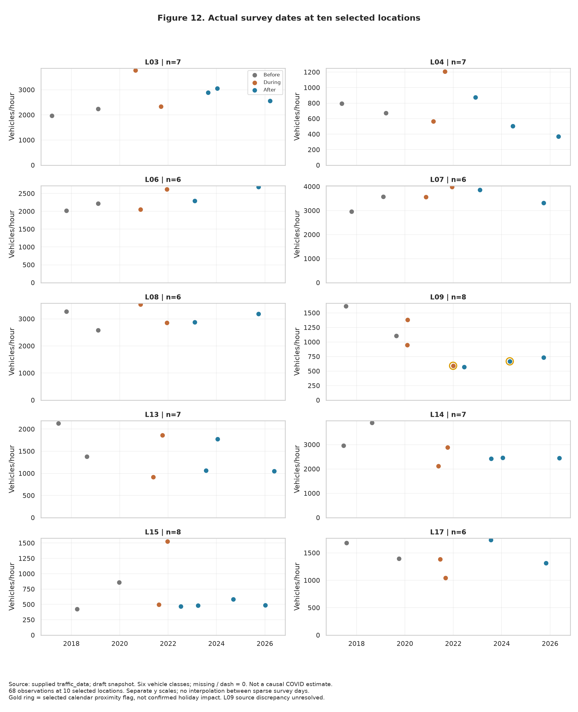
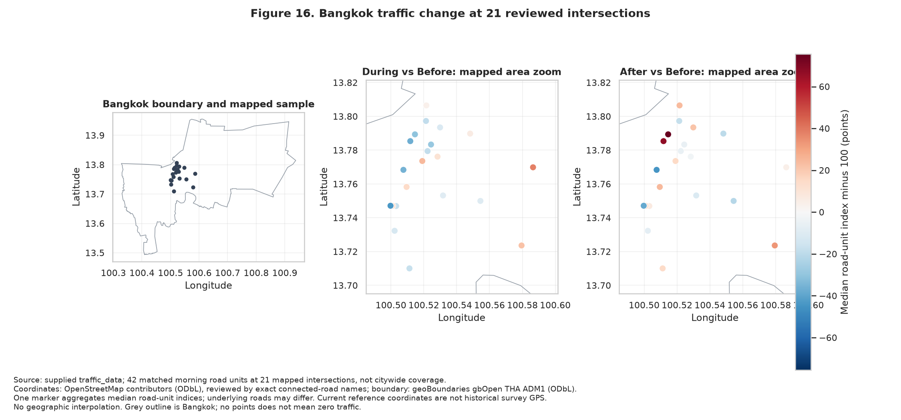

# คำอธิบายกราฟเพิ่มเติม 11–16

ตัวเลขคำอธิบายเป็น snapshot SHA-256 6e1b556f353c66fec5c8a664f3e1e5b5e52e5a756f75c2ae28562c5c0fa6118b หากอัปโหลดข้อมูลรุ่นใหม่ ให้ยึดตัวเลขในกราฟและ CSV ที่รันใหม่ และทบทวนข้อความตีความอีกครั้ง

กราฟชุดนี้ต่อจากกราฟเดิม 1–10 ใช้ไฟล์ traffic_data รุ่นเดิม และใช้ covid_period ตามไฟล์โดยตรง ผลยังเป็นฉบับร่าง รวมทั้งค่าศูนย์ที่พบความต่างจาก PDF ในแถว Excel 704 ซึ่งยังไม่ได้แก้ต้นฉบับ

## กราฟ 11 — Heatmap สถานที่ × ช่วงโควิด

**คำถาม:** แต่ละสถานที่มีรูปแบบการเปลี่ยนแปลงเหมือนกันหรือไม่?

**วิธีอ่าน:** แต่ละแถวคือคู่ทางแยก–ถนนช่วง 07:00–09:00 ที่มีอย่างน้อย 2 รายการในแต่ละช่วงโควิด รวม 17 คู่ คอลัมน์คือ Before/During/After ตัวเลขคือดัชนีที่ Before=100 สีน้ำเงินต่ำกว่าฐาน สีแดงสูงกว่าฐาน จำนวนข้างรหัสเป็น n ของแต่ละช่วง ไม่ใช่จำนวนรถ

**ผลและความหมาย:** บางขุนนนท์–จรัญสนิทวงศ์ (L03) สูงกว่าฐานทั้ง During และ After ส่วนมิตรไมตรี (L09) ต่ำกว่าฐานทั้งสองช่วง ขณะที่ห้วยขวาง–ประชาสงเคราะห์ (L15) สูงใน During แต่ต่ำใน After จึงไม่ควรเล่าทุกสถานที่เป็นรูปแบบเดียวกัน

**ข้อจำกัด:** แต่ละสถานที่เก็บคนละเดือนและมีวันสำรวจน้อย รหัส L09 มีรายการที่ต้องทวนต้นทาง Heatmap นี้เป็นตาราง ไม่ใช่แผนที่ภูมิศาสตร์

**ตารางประกอบ:** [ค่ากราฟ](location_period_heatmap.csv), [รหัสและชื่อสถานที่](location_code_lookup.csv)

## กราฟ 12 — วันสำรวจจริงรายสถานที่

**คำถาม:** ผลที่เห็นเกิดจากหลายวันสอดคล้องกัน หรือไวต่อวันสำรวจบางวัน?

**วิธีอ่าน:** 10 ช่องแทนสิบคู่ที่แสดงในกราฟ 8 รวม 68 รายการ แกนนอนเป็นวันสำรวจจริง แกนตั้งเป็นคันต่อชั่วโมง สีแสดง covid_period จุดไม่ได้เชื่อมเป็นเส้น เพราะไม่มีข้อมูลระหว่างวันสำรวจ แต่ละช่องใช้ช่วงแกนตั้งต่างกันเพื่อดูความแปรปรวนภายในสถานที่

**ผลและความหมาย:** เห็นฐาน Before ของห้วยขวางที่มีเพียงสองวันและค่าห่างกันมาก รวมถึง After ของเตาปูนที่มีเพียงสองวัน จึงอธิบายได้ว่าทำไมข้อสรุปของบางแห่งจึงไวต่อการตัดวันออกหนึ่งรายการ

**วงสีทอง:** เป็นการทำเครื่องหมายใกล้ปฏิทินบางช่วง เช่น ใกล้ปีใหม่หรือวันถัดจากวันแรงงาน ไม่ใช่การยืนยันว่ามีเทศกาลในพื้นที่หรือเทศกาลทำให้ปริมาณรถเปลี่ยน

**ข้อจำกัด:** ไม่ใช้เปรียบเทียบความสูงของจุดข้ามช่องโดยไม่อ่านแกน ไม่ใช่ข้อมูลต่อเนื่องรายวัน และยังไม่มีข้อมูลฝน/ก่อสร้าง/OD มาอธิบายสาเหตุ

**ตารางประกอบ:** [วันที่ วันในสัปดาห์ คันต่อชั่วโมง และแถว Excel](case_survey_dates.csv)

## กราฟ 13 — Bubble ปริมาณฐาน × การเปลี่ยนแปลง

**คำถาม:** สถานที่ใดมีปริมาณฐานสูงและเปลี่ยนแปลงมาก เหมาะเลือกติดตามเพิ่มเติม?

**วิธีอ่าน:** แกนนอนเป็นมัธยฐานคันต่อชั่วโมงก่อนโควิด แกนตั้งเป็นเปอร์เซ็นต์ After เทียบ Before ขนาดพื้นที่จุดแสดงจำนวนรายการสำรวจรวมสามช่วง สีแยกเพิ่มกับลด เส้นตั้งเป็นมัธยฐานของปริมาณฐานในตัวอย่าง ไม่ใช่ความจุถนนหรือเกณฑ์ของหน่วยงาน

**ผลและความหมาย:** แยกสถานที่ที่เพิ่มมากเชิงเปอร์เซ็นต์ออกจากสถานที่ที่มีปริมาณรถเดิมสูงได้ บางขุนนนท์ (L03) เพิ่มชัด ขณะที่บางสถานที่มีฐานสูงแต่ดัชนียังต่ำกว่าฐาน การเลือกติดตามควรดูทั้งขนาดและการเปลี่ยนแปลง

**ข้อจำกัด:** ใช้เพียง 17 คู่ที่ผ่านเกณฑ์เวลาเช้า ขนาดจุดมากไม่ได้แปลว่าตัวอย่างสุ่มหรือมีคุณภาพสูงกว่าเสมอ ผลไม่ได้บอกความติดขัดหรือความจำเป็นต้องปรับสัญญาณไฟ

**ตารางประกอบ:** [ข้อมูล Bubble และจำนวนตัวอย่าง](location_bubble_data.csv)

## กราฟ 14 — ผลต่างค่าเฉลี่ยแยกประเภทรถ

**คำถาม:** รถประเภทใดเป็นส่วนประกอบหลักของผลต่างเชิงตัวเลข?

**วิธีอ่าน:** แท่งสีแต่ละประเภทคือค่าเฉลี่ยคันต่อชั่วโมง After ลบ Before ค่าบวกไปขวา ค่าลบไปซ้าย ผลบวกแบบมีเครื่องหมายของทั้งหกประเภทรวมเท่ากับผลต่างค่าเฉลี่ยจำนวนรถรวมของสถานที่นั้น

**ผลและความหมาย:** บางขุนนนท์ (L03) มีส่วนเพิ่มจากรถยนต์นั่งเด่น ส่วนมิตรไมตรี (L09) และหลักสี่–แจ้งวัฒนะ (L14) มีส่วนลดจากรถยนต์นั่งมาก หลักสี่–กำแพงเพชร 6 (L13) มีตู้/ปิกอัพเพิ่มสวนกับรถยนต์นั่งที่ลด

**ข้อจำกัด:** ใช้ค่าเฉลี่ยเพื่อให้ส่วนประกอบรวมกันได้ จึงไม่ใช่การแยกดัชนีมัธยฐานของกราฟ 8 และไม่ใช่การแยกสาเหตุของการเปลี่ยนแปลง ค่ารถบางประเภทอาจได้รับผลจากการรวบรวมข้อมูลและสมมติฐานศูนย์

**ตารางประกอบ:** [ผลต่างค่าเฉลี่ยรถทั้งหกประเภท](vehicle_mean_contributions.csv)

## กราฟ 15 — ดัชนีพร้อมช่วงความไม่แน่นอน

**คำถาม:** ค่ากลางในตัวอย่างมีความไม่แน่นอนเพียงใด?

**วิธีอ่าน:** จุดคือมัธยฐานดัชนี เส้นแนวนอนคือช่วง percentile 95% จาก bootstrap 3,000 รอบ โดยสุ่มเป็นกลุ่มทางแยก 175 แห่งและเก็บหน่วยถนน/เวลาในแยกนั้นไปด้วย รวมชุดหลัก 623 หน่วย เส้นตั้ง 100 คือฐาน Before

**ผลและความหมาย:** During 91.6 มีช่วง 88.4–94.9 และ After 90.4 มีช่วง 86.6–93.8 ภายในแบบจำลองการสุ่มซ้ำนี้ค่ากลางยังต่ำกว่าฐาน

**ข้อจำกัด:** ช่วงนี้ไม่รวมความคลาดเคลื่อนต้นทาง การเลือกสถานที่ที่ไม่สุ่ม ความต่างปฏิทิน หรือผลโครงข่าย จึงไม่ใช่ช่วงความเชื่อมั่นของผลเชิงสาเหตุจากโควิด และไม่ได้พิสูจน์ว่า After ต่างจาก During

**ตารางประกอบ:** [Bootstrap พร้อม seed และจำนวนรอบ](cluster_bootstrap.csv)

## กราฟ 16 — แผนที่การเปลี่ยนแปลงในกรุงเทพฯ

**คำถาม:** จุดที่ตรวจพิกัดได้กระจายอยู่บริเวณไหน และแสดงรูปแบบเพิ่ม–ลดอย่างไร?

**วิธีอ่าน:** ช่องซ้ายแสดงขอบเขตกรุงเทพฯ และตำแหน่งจุดที่มีข้อมูล ช่องกลางและขวาขยายบริเวณจุดที่จับคู่ได้ แสดง During และ After เทียบ Before สีเดียวกันใช้สเกลเดียวกัน สีน้ำเงินต่ำกว่าฐาน สีแดงสูงกว่าฐาน หนึ่งจุดแสดงมัธยฐานดัชนีของคู่ถนนที่ผ่านการตรวจในแยกนั้น เฉพาะช่วง 07:00–09:00

**ขอบเขต:** 21 ทางแยก รวม 42 คู่ทางแยก–ถนน จากชุดหลัก 175 ทางแยก อีก 154 ทางแยกยังไม่อยู่ในแผนที่นี้ พื้นที่ไม่มีจุดไม่ใช่ปริมาณรถศูนย์ จึงไม่ระบายค่าต่อเนื่องทั่วเมืองและไม่ตีความเป็น hotspot ทั้งกรุงเทพฯ

**วิธีตรวจพิกัด:** ใช้จุด OpenStreetMap ที่ระบุเป็น junction และจับคู่ชื่อทางแยกหลังตัดคำขึ้นต้นแยก จากนั้นตรวจชื่อถนนที่เชื่อมกับ node โดยตรง เลือกเฉพาะคู่ถนนที่ตรงกันและอยู่ในขอบเขตกรุงเทพฯ ตัวอย่างชื่อที่ไม่ผ่านคือ “พัฒนาการ” เพราะถนนที่เชื่อมพิกัดไม่ใช่ถนนคู่เดียวกับข้อมูลเรา

**แหล่งภูมิศาสตร์:** [OpenStreetMap contributors](https://www.openstreetmap.org/copyright) และ [geoBoundaries — THA ADM1](https://www.geoboundaries.org/api/current/gbOpen/THA/ADM1/) บันทึก metadata และใบอนุญาตใน data/reference/map_sources.json ใช้ขอบเขตและพิกัดอ้างอิงปัจจุบัน ไม่ใช่ GPS ที่หน่วยงานบันทึกในวันสำรวจ

**ข้อจำกัด:** ตรวจได้จากชื่อและโครงข่ายในแผนที่ ไม่ได้ยืนยันตำแหน่งจุดยืนตรวจนับในอดีต จุดเดียวอาจมีถนนที่เปลี่ยนต่างทิศกัน ต้องอ่านตารางรายถนนประกอบ ไม่มีแผนที่จำนวนรถติดหรือแผนที่ผลเชิงสาเหตุของโควิด

**แผนที่โต้ตอบ:** [เปิดแผนที่ออฟไลน์ เลือกช่วงโควิดและคลิกชื่อทางแยก](bangkok_map_interactive.html)

**ตารางประกอบ:** [ค่ารายถนนพร้อมพิกัดและลิงก์ OSM](map_road_period_indices.csv), [ค่าที่ใช้แสดงรายจุด](map_intersection_summary.csv)

## แนวทางจากงานรุ่นพี่

ศึกษาแนวการใช้แผนที่จาก [Earthquake](https://github.com/tontantip/DADS5001-Project-Earthquake/), การวางขนาดกับการเปลี่ยนแปลงจาก [IPUC](https://github.com/ChotepipatC/DADS5001), และการดูการกระจาย/ความถี่ประกอบค่ากลางจาก [PM2.5](https://github.com/Porrakij/PM2.5-Data-Analysis) ไม่ได้นำข้อมูลหรือโค้ดของงานเหล่านั้นมาคำนวณผลจราจร

สำหรับ Pitch เลือกกราฟที่ตอบคนละคำถาม เช่น coverage → ภาพรวม → heatmap สถานที่ → วันสำรวจ → แผนที่ → กรณีศึกษา พร้อมข้อจำกัด ไม่จำเป็นต้องแสดงครบ 16 รูปในเวลาจำกัด
