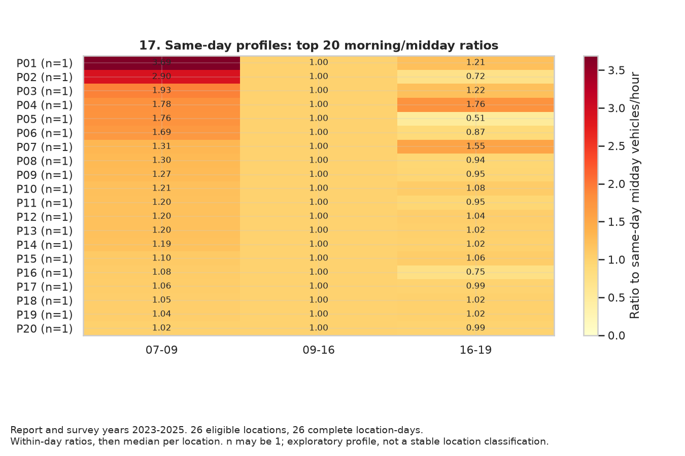
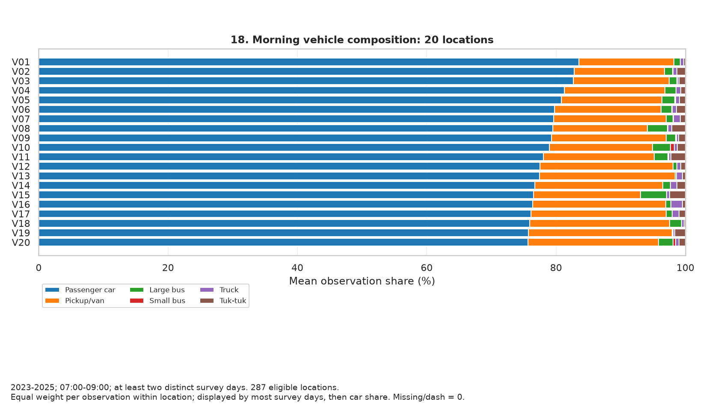
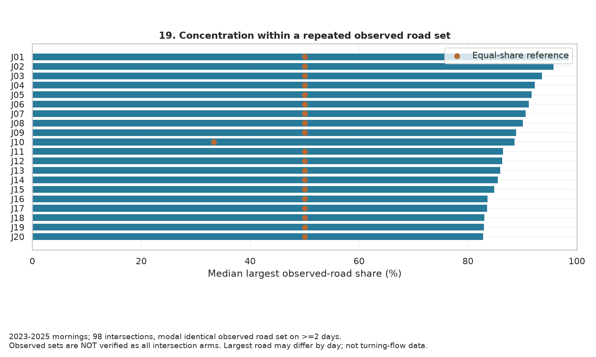
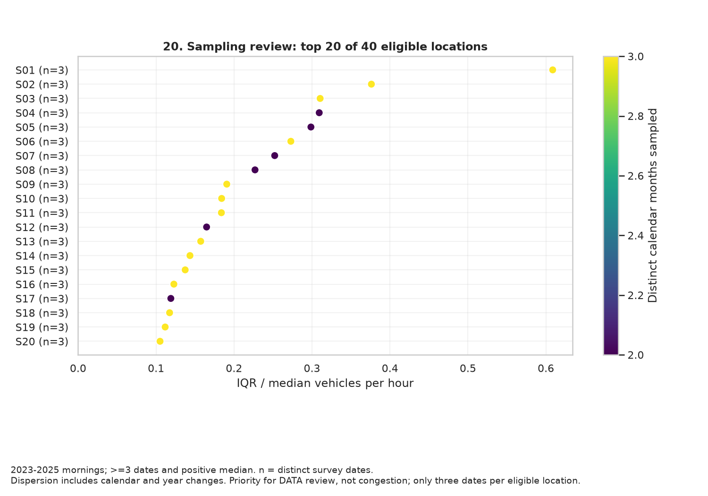

# รูปแบบปริมาณรถและความต้องการข้อมูลเพิ่มเติม

ใช้ปีรายงานและปีสำรวจ 2023–2025 ซึ่งเป็นสามปีเต็มล่าสุดในไฟล์ ไม่ใช้ COVID เป็นแกนเปรียบเทียบ ไม่เปลี่ยน label เดิม และไม่รวมปี 2026 บางปี

## ข้อค้นพบที่ใช้เล่าเรื่องได้

- หน้าแฟลตทหารเรือ / ทางเข้าออกแฟลตทหารเรือ: ช่วงเช้ามีรถต่อชั่วโมง 3.69 เท่าของกลางวัน แต่มีวันครบสามช่วงเพียง 1 วัน จึงเป็นข้อสังเกตของวันนั้น ไม่ยืนยันรูปแบบประจำ
- ห้วยขวาง / รัชดาภิเษก: รถยนต์นั่งเฉลี่ย 83.54% จาก 3 วันสำรวจเช้า เป็นสัดส่วนในรถหกประเภทที่ไฟล์บันทึก ไม่ใช่สัดส่วนผู้เดินทางทั้งหมด
- แยกวัดสน: ค่ามัธยฐานส่วนแบ่งถนนที่มีรถมากที่สุด 98.57% ในชุดถนน 2 สายที่รายงานซ้ำ 2 วัน เหมาะทวนความครบถ้วนของถนนก่อนอธิบายความต่าง
- บรมราชชนนี / บรมราชชนนี: IQR/median=0.609 จาก 3 วัน ควรเก็บซ้ำในเดือนและวันประเภทเดียวกันเพื่อแยกความเปลี่ยนแปลงตามเวลาออกจากความผันผวน

กราฟ 19 เลือกชุดถนนที่พบซ้ำบ่อยที่สุด หากความถี่เท่ากันเลือกตามลำดับชื่อ ชุดอื่นจึงไม่รวมในผลนี้

## รูปแบบปริมาณรถภายในวันเดียวกัน

เทียบปริมาณเช้า/กลางวัน/เย็นจากวันและถนนเดียวกัน โดยกลางวัน=1 ใช้เวลา 09–16 เท่านั้น ไม่รวม 09–17 รหัส P แสดงชื่อใน CSV; เลือก 20 อันดับอัตราส่วนเช้าสูงสุด ไม่ใช่ตัวแทนทั้งเมือง วันสำรวจน้อยยังบอกบุคลิกถาวรของพื้นที่ไม่ได้

| intersection_key | road_key | 07:00-09:00 | 09:00-16:00 | 16:00-19:00 | visits | code |
| --- | --- | --- | --- | --- | --- | --- |
| หน้าแฟลตทหารเรือ | ทางเข้าออกแฟลตทหารเรือ | 3.688 | 1.0 | 1.212 | 1 | P01 |
| ภาวนา | ลาดพร้าว 44 | 2.9 | 1.0 | 0.722 | 1 | P02 |
| หน้าแฟลตทหารเรือ | จ่าโสด | 1.93 | 1.0 | 1.221 | 1 | P03 |
| เพชรเกษม 69 - อินทราปัจ 13 | อินทราปัจ 13 | 1.776 | 1.0 | 1.765 | 1 | P04 |
| ภาวนา | ลาดพร้าว 41 | 1.758 | 1.0 | 0.505 | 1 | P05 |
| สะพานแดง | เตชะวณิช | 1.695 | 1.0 | 0.869 | 1 | P06 |
| ภาวนา | ลาดพร้าว 37 | 1.312 | 1.0 | 1.546 | 1 | P07 |
| ราษฎร์อุทิศ 18 | ราษฎร์อุทิศ | 1.296 | 1.0 | 0.938 | 1 | P08 |
| ราษฎร์อุทิศ 38/1 | ราษฎร์อุทิศ 38/1 | 1.273 | 1.0 | 0.955 | 1 | P09 |
| สะพานแดง | ทหาร | 1.211 | 1.0 | 1.079 | 1 | P10 |
| เพชรเกษม 69 - อินทราปัจ 13 | เลียบคลองภาษีเจริญฝั่งเหนือ | 1.201 | 1.0 | 0.947 | 1 | P11 |
| เฉลิมกรุง | เจริญกรุง | 1.2 | 1.0 | 1.043 | 1 | P12 |
| เฉลิมกรุง | ตีทอง | 1.196 | 1.0 | 1.023 | 1 | P13 |
| สุโขทัย | พระรามที่ 5 | 1.191 | 1.0 | 1.022 | 1 | P14 |
| ราษฎร์อุทิศ 38/1 | ราษฎร์อุทิศ | 1.099 | 1.0 | 1.058 | 1 | P15 |
| ราษฎร์อุทิศ 18 | ราษฎร์อุทิศ 18 | 1.077 | 1.0 | 0.754 | 1 | P16 |
| สวนมิกสกวัน | พิษณุโลก | 1.058 | 1.0 | 0.988 | 1 | P17 |
| สะพานแดง | ประดิพัทธ์ | 1.05 | 1.0 | 1.015 | 1 | P18 |
| สุโขทัย | สุโขทัย | 1.037 | 1.0 | 1.017 | 1 | P19 |
| เพชรเกษม 69 - อินทราปัจ 13 | เพชรเกษม 69 | 1.016 | 1.0 | 0.986 | 1 | P20 |

## องค์ประกอบรถรายสถานที่

แต่ละแท่งแสดงค่าเฉลี่ยสัดส่วนรถรายวันในช่วงเช้า ต้องมีอย่างน้อยสองวัน รถจำนวนเท่ากันอาจมีองค์ประกอบต่างกัน ไม่อนุมานปลายทางหรือวัตถุประสงค์จากประเภทรถ

| intersection_key | road_key | passenger_car_share | pickup_van_share | large_bus_share | small_bus_share | truck_share | tuk_tuk_share | visits | code |
| --- | --- | --- | --- | --- | --- | --- | --- | --- | --- |
| ห้วยขวาง | รัชดาภิเษก | 83.543 | 14.656 | 1.044 | 0.003 | 0.508 | 0.245 | 3 | V01 |
| ราชเทวี | พญาไท | 82.834 | 13.905 | 1.302 | 0.026 | 0.632 | 1.302 | 3 | V02 |
| ราชประสงค์ | เพลินจิต | 82.645 | 14.834 | 1.19 | 0.056 | 0.289 | 0.985 | 3 | V03 |
| วิทยุ - เพชร | วิทยุ - ทางขึ้นลงทางด่วน | 81.279 | 15.533 | 1.717 | 0.018 | 0.756 | 0.696 | 3 | V04 |
| พญาไท | พญาไท | 80.815 | 15.529 | 1.98 | 0.14 | 0.624 | 0.912 | 3 | V05 |
| บรมราชชนนี | จรัญสนิทวงศ์ | 79.764 | 16.457 | 1.685 | 0.046 | 0.642 | 1.406 | 3 | V06 |
| เพลินจิต | วิทยุ | 79.61 | 17.404 | 1.103 | 0.025 | 1.073 | 0.785 | 3 | V07 |
| ปทุมวัน | พญาไท | 79.516 | 14.582 | 3.141 | 0.035 | 0.596 | 2.13 | 3 | V08 |
| เพลินจิต | เพลินจิต | 79.288 | 17.774 | 1.443 | 0.114 | 0.328 | 1.053 | 3 | V09 |
| ราชประสงค์ | ราชดำริ | 78.938 | 16.0 | 2.78 | 0.563 | 0.46 | 1.26 | 3 | V10 |
| ราชเทวี | เพชรบุรี | 78.045 | 17.111 | 2.149 | 0.14 | 0.331 | 2.224 | 3 | V11 |
| พญาไท | ศรีอยุธยา | 77.496 | 20.59 | 0.591 | 0.034 | 0.568 | 0.721 | 3 | V12 |
| ทองหล่อ | สุขุมวิท 55 | 77.442 | 20.961 | 0.226 | 0.0 | 0.894 | 0.478 | 3 | V13 |
| เกษมราษฎร์ | พระรามที่ 4 | 76.729 | 19.778 | 1.206 | 0.0 | 0.961 | 1.326 | 3 | V14 |
| ปทุมวัน | พระรามที่ 1 | 76.554 | 16.522 | 3.996 | 0.022 | 0.492 | 2.415 | 3 | V15 |
| เจริญราษฎร์ | พระรามที่ 3 | 76.422 | 20.513 | 0.841 | 0.005 | 1.787 | 0.433 | 3 | V16 |
| เกษมราษฎร์ | เกษมราษฎร์ | 76.142 | 20.875 | 0.967 | 0.0 | 1.033 | 0.983 | 3 | V17 |
| นิด้า | ศรีบูรพา | 75.935 | 21.657 | 1.792 | 0.0 | 0.424 | 0.192 | 3 | V18 |
| หลังสวน | หลังสวน | 75.723 | 22.26 | 0.138 | 0.0 | 0.258 | 1.62 | 3 | V19 |
| บรมราชชนนี | บรมราชชนนี | 75.681 | 20.186 | 2.215 | 0.375 | 0.564 | 0.979 | 3 | V20 |

## การกระจุกตัวบนถนนที่รายงานในแยก

คัดเฉพาะชุดถนนที่ปรากฏเหมือนกันซ้ำอย่างน้อยสองวัน จุดส้มคือสัดส่วนถ้าแบ่งเท่ากันทุกถนนในชุดนั้น ชุดที่รายงานยังไม่ยืนยันว่าครบทุกแขนแยก จึงใช้คำว่าส่วนแบ่งในถนนที่รายงาน ไม่ใช่การไหลทั้งแยก

| intersection | days | roads | median_largest_road_share | equal_share_reference | road_set | code |
| --- | --- | --- | --- | --- | --- | --- |
| วัดสน | 2 | 2 | 98.569 | 50.0 | สุขสวัสดิ์ / สุขสวัสดิ์ 35 | J01 |
| ลาซาล | 2 | 2 | 95.808 | 50.0 | สุขุมวิท / สุขุมวิท 105 | J02 |
| เกตุนุช | 2 | 2 | 93.677 | 50.0 | ลาดพร้าว / ลาดพร้าว 64 | J03 |
| บางแค | 2 | 2 | 92.38 | 50.0 | บางแค / เพชรเกษม | J04 |
| จันทิมา | 2 | 2 | 91.761 | 50.0 | ลาดพร้าว / ลาดพร้าว 80 | J05 |
| กษัตริย์ศึก | 2 | 2 | 91.238 | 50.0 | กรุงเกษม / บำรุงเมือง | J06 |
| ลาดปลาเค้า | 2 | 2 | 90.699 | 50.0 | รามอินทรา / ลาดปลาเค้า | J07 |
| พระโขนง | 3 | 2 | 90.149 | 50.0 | พระรามที่ 4 / สุขุมวิท | J08 |
| สุขุมวิท 39 | 2 | 2 | 88.888 | 50.0 | สุขุมวิท / สุขุมวิท 39 | J09 |
| แปลงนาม | 2 | 3 | 88.65 | 33.333 | พลับพลาไชย / เจริญกรุง / แปลงนาม | J10 |
| สาทร - คอนแวนต์ | 2 | 2 | 86.545 | 50.0 | คอนแวนต์ / สาทร | J11 |
| เพชรเกษม 81 | 2 | 2 | 86.402 | 50.0 | เพชรเกษม / เพชรเกษม 81 | J12 |
| พัฒนาการ - พัฒนาการ 53 | 2 | 2 | 86.027 | 50.0 | พัฒนาการ / พัฒนาการ 53 | J13 |
| เจริญราษฎร์ | 3 | 2 | 85.562 | 50.0 | พระรามที่ 3 / เจริญราษฎร์ | J14 |
| ทุ่งสาธิต | 2 | 2 | 84.923 | 50.0 | สุขุมวิท / สุขุมวิท 101/1 | J15 |
| หัวลำโพง | 2 | 2 | 83.692 | 50.0 | พระรามที่ 4 / มหาพฤฒาราม | J16 |
| รัชดา - สุทธิสาร | 2 | 2 | 83.585 | 50.0 | รัชดาภิเษก / สุทธิสารวินิจฉัย | J17 |
| เกษมราษฎร์ | 3 | 2 | 83.067 | 50.0 | พระรามที่ 4 / เกษมราษฎร์ | J18 |
| กรุงธนบุรีใต้ | 2 | 2 | 83.042 | 50.0 | กรุงธนบุรี / เจริญนคร | J19 |
| โพธิ์สามต้น | 2 | 2 | 82.887 | 50.0 | วังเดิม / อิสรภาพ | J20 |

## ความครอบคลุมและความแปรปรวนของข้อมูล

แกนนอน IQR/median แกนตั้งรหัสสถานที่ พร้อมจำนวนวัน n สีแสดงจำนวนเดือนปฏิทินที่ครอบคลุม แสดง 20 อันดับสูงสุดจาก 40 สถานที่ ซึ่งทุกแห่งมีเพียง 3 วัน ค่าสูงและข้อมูลน้อยควรตรวจหรือเก็บเพิ่ม ยังไม่สร้างคะแนนความสำคัญด้วยน้ำหนักตามใจ และไม่ใช่อันดับรถติด

| intersection_key | road_key | median | q25 | q75 | days | months | years | zero_assumed_rows | relative_iqr | code |
| --- | --- | --- | --- | --- | --- | --- | --- | --- | --- | --- |
| บรมราชชนนี | บรมราชชนนี | 3304.5 | 3189.0 | 5200.5 | 3 | 3 | 2 | 0 | 0.609 | S01 |
| พระโขนง | พระรามที่ 4 | 478.5 | 433.5 | 613.5 | 3 | 3 | 2 | 0 | 0.376 | S02 |
| ราชประสงค์ | พระรามที่ 1 | 426.0 | 302.25 | 434.5 | 3 | 3 | 3 | 0 | 0.31 | S03 |
| พระรามที่ 2 | สุขสวัสดิ์ | 3414.5 | 3414.5 | 4470.5 | 3 | 2 | 3 | 0 | 0.309 | S04 |
| พญาไท | ศรีอยุธยา | 4477.0 | 4195.25 | 5532.25 | 3 | 2 | 3 | 0 | 0.299 | S05 |
| ราชเทวี | เพชรบุรี | 4149.5 | 3055.0 | 4187.25 | 3 | 3 | 3 | 0 | 0.273 | S06 |
| พระรามที่ 2 | พระรามที่ 2 | 2310.0 | 2310.0 | 2892.5 | 3 | 2 | 3 | 0 | 0.252 | S07 |
| วิทยุ - เพชร | เพชรบุรี | 1933.5 | 1933.5 | 2372.25 | 3 | 2 | 3 | 0 | 0.227 | S08 |
| ราชเทวี | พญาไท | 3772.0 | 3492.25 | 4211.5 | 3 | 3 | 3 | 0 | 0.191 | S09 |
| หน้าโรงเรียนสุเหร่าแสนแสบ | ประชาร่วมใจ | 907.0 | 896.5 | 1063.5 | 3 | 3 | 3 | 0 | 0.184 | S10 |
| ราชประสงค์ | เพลินจิต | 1999.5 | 1986.0 | 2353.5 | 3 | 3 | 3 | 0 | 0.184 | S11 |
| คลองสาน | ลาดหญ้า | 717.5 | 645.25 | 763.5 | 3 | 2 | 3 | 0 | 0.165 | S12 |
| บรมราชชนนี | จรัญสนิทวงศ์ | 4516.0 | 4158.0 | 4868.25 | 3 | 3 | 2 | 0 | 0.157 | S13 |
| ทองหล่อ | สุขุมวิท | 2477.5 | 2213.75 | 2569.25 | 3 | 3 | 3 | 0 | 0.143 | S14 |
| ราชประสงค์ | ราชดำริ | 1969.5 | 1884.75 | 2155.25 | 3 | 3 | 3 | 0 | 0.137 | S15 |

## ข้อจำกัดร่วม

ค่าว่าง/ขีดเป็นศูนย์ตามข้อตกลง; ความคลาดเคลื่อนต้นทางที่เคยพบยังต้องทวน การใช้ช่วงปีเดียวกันไม่รับรองเดือนและวันตรงกันระหว่างพื้นที่ กราฟเป็นผลเชิงพรรณนาของสถานที่ที่ผ่านเกณฑ์ ไม่ใช่ตัวแทนรถทั้งหมดในกรุงเทพฯ
